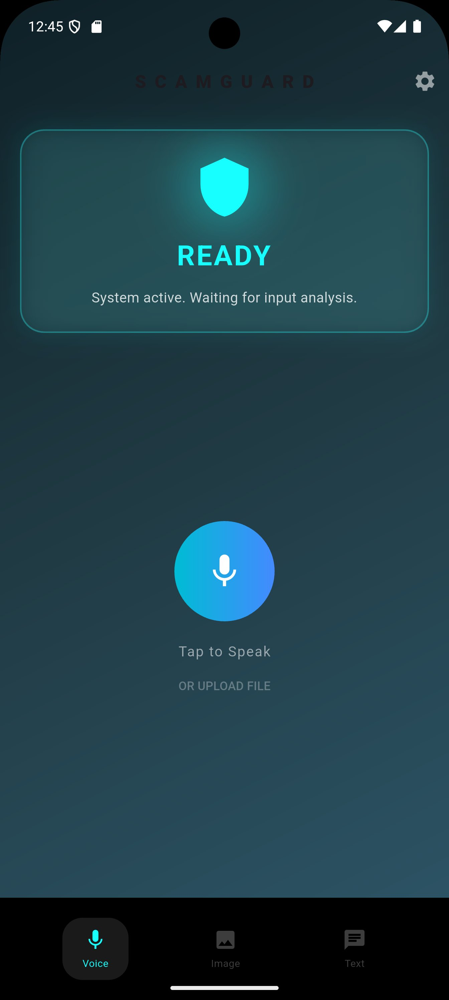
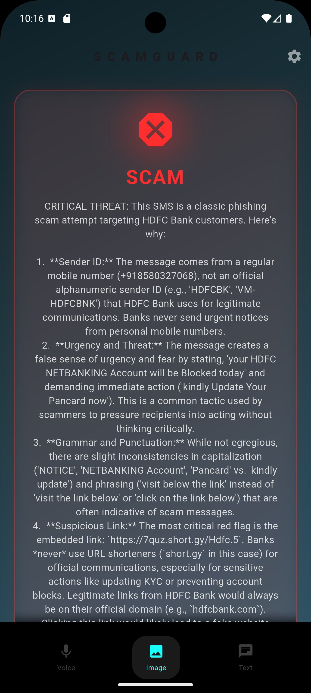

# 🛡️ ScamGuard: Tri-Modal AI Fraud Detection System


**ScamGuard** is a real-time, cross-platform mobile cybersecurity application designed to proactively detect and prevent financial fraud, social engineering, and voice phishing (vishing) attacks.

Unlike traditional security apps that rely on static, easily-spoofed blacklists, ScamGuard utilizes a **Reliability-Aware Tri-Modal Fusion Architecture** to analyze the *behavior* and *intent* of an interaction across Voice, Text, and Visual data streams.

---

## ✨ Key Features

- **🎙️ Acoustic Forensics (Tone Analysis):** Uses local Edge processing (Librosa + Random Forest) to extract Mel-Frequency Cepstral Coefficients (MFCCs) and detect vocal urgency, aggression, and panic.
- **🧠 Contextual Reasoning (LLM Intent):** Integrates Google Gemini 1.5 Flash to perform deep semantic reasoning on transcripts, catching logical fallacies and manipulation tactics (e.g., a "Bank Manager" asking for Gift Cards).
- **👁️ Visual Phishing Detection:** Analyzes uploaded screenshots of fake banking receipts, malicious SMS links, and phishing emails using Multimodal Vision AI.
- **🌐 Multilingual Support:** Automatically detects and analyzes scams across 100+ languages (English, Hindi, Spanish, Mandarin, etc.) using the Gemini audio pipeline.
- **🔒 Privacy-First Edge-Cloud Hybrid:** Raw audio is processed ephemerally on the user's local device. Only anonymized mathematical feature vectors and transcripts are sent to the cloud — no audio is stored.
- **🗣️ Explainable AI (XAI):** Doesn't just say "Scam." Provides natural language explanations detailing *why* an interaction is dangerous.

---

## 🏗️ System Architecture

ScamGuard operates on a hybrid deployment pipeline balancing latency and computational load:

1. **Edge Processor (Mobile Device):** Handles Voice Activity Detection (VAD), audio normalization, and lightweight MFCC extraction.
2. **Cloud Reasoning Engine (Flask Server):** Receives features, generates transcripts, and passes data to the Large Language Model (Gemini) for logical analysis.
3. **Reliability-Aware Fusion Engine (RAFE):** Dynamically weights the Acoustic Score and the Semantic Score depending on data quality (e.g., relying more on text if background noise is high).

---

## 🛠️ Tech Stack

| Layer | Technology |
|---|---|
| Frontend | Flutter (Dart) |
| Backend | Python, Flask |
| AI / ML | Google Gemini 1.5 Flash, Scikit-Learn (Random Forest) |
| Audio Processing | Librosa, FFmpeg, SpeechRecognition |

---

## 🚀 Installation & Setup (Backend)

### Prerequisites

- Python 3.9+
- [FFmpeg](https://ffmpeg.org/download.html) installed and added to your system PATH
- A valid Google Gemini API Key

### 1. Clone the Repository

```bash
git clone https://github.com/yourusername/ScamGuard.git
cd ScamGuard/backend
```

### 2. Install Dependencies

```bash
pip install -r requirements.txt
```

Required packages: `flask`, `google-generativeai`, `librosa`, `scikit-learn`, `SpeechRecognition`, `Pillow`, `numpy`

### 3. Configure Environment Variables

Create a `.env` file in the root directory and add your Gemini API key:

```ini
GEMINI_API_KEY=your_api_key_here
```

### 4. Run the Flask Server

```bash
python app.py
```

The server will start on `http://0.0.0.0:5000` and display your local network IP for mobile emulator connection.

---

## 📡 API Endpoints

### `POST /detect`

The primary endpoint for threat analysis. Accepts `multipart/form-data`.

**Accepted Payloads:**

| Type | Field | Format |
|---|---|---|
| Audio Call | `audio` | file (`.m4a`, `.wav`) |
| Screenshot | `image` | file (`.png`, `.jpg`) |
| Text Message | `text` | string |

**Sample JSON Response:**

```json
{
  "type": "Voice Call",
  "content_detected": "[English] The caller is threatening to block the HDFC bank account unless immediate action is taken.",
  "urgency_score": 0.85,
  "fusion_debug": {
    "audio_contribution": 34.0,
    "llm_contribution": 54.0,
    "weights": "Audio: 0.4, LLM: 0.6",
    "final_score": 88.0
  },
  "gemini_analysis": {
    "is_scam": true,
    "risk_score": 90,
    "reasoning": "The caller is inducing a false sense of urgency and threatening account closure, a classic social engineering tactic."
  },
  "final_verdict": "SCAM"
}
```

---

## 📱 Screenshots

| Ready State | Scam Detected |
|:-----------:|:-------------:|
|  |  |

---

## 📄 License

This project is licensed under the [MIT License](LICENSE).
